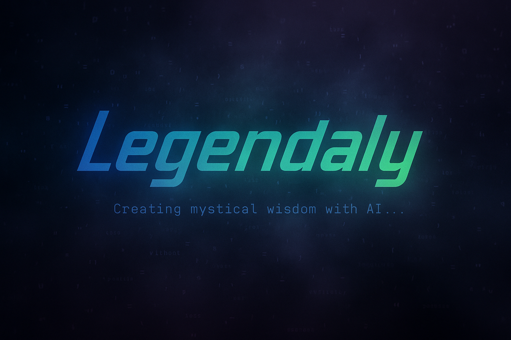
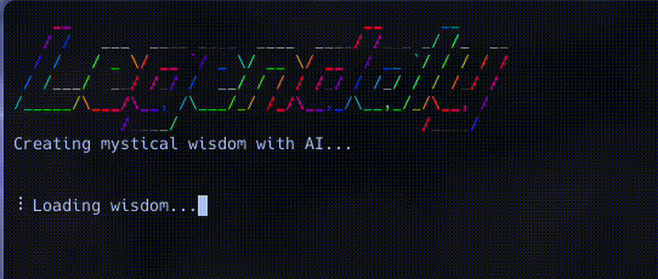
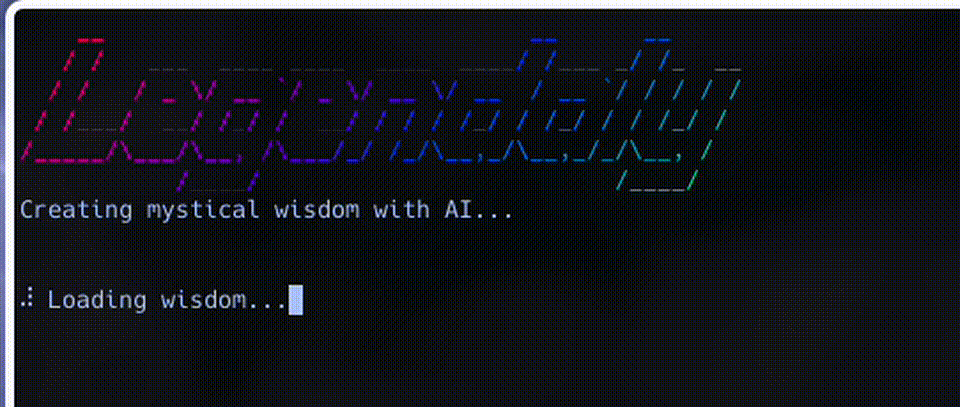

# Legendaly 🧙‍♂️



**Legendaly** is a terminal-based legendary quote generator powered by OpenAI GPT-4.
It types out beautiful quotes like a sage, then fades them into mist, one by one.

## Features

- Generate AI-crafted "legendary" quotes with character attribution
- Pre-fetch multiple quotes in a single API call for efficiency
- Display with customizable typewriter animation
- Fade out like mist (supports full-width Japanese characters)
- Loop through quotes with configurable timing
- Cyberpunk glitch effects (when using cyberpunk tone)
- Support for various visual themes and fonts
- Elegant loading animation during quote generation
- Stylish "To Be Continued..." exit message
- Multilingual support for seven languages
- Language resources are stored in the `locales/` directory for easy customization
- Organized quote logging with metadata in the `echoes/` directory
- **NEW**: Automatic configuration validation with helpful warnings
- **NEW**: Robust error handling with automatic retry mechanism
- **NEW**: Automatic log rotation (10MB limit) and cleanup (30 days retention)
- **NEW**: Modular architecture for better maintainability

## Installation

```bash
npm install
```

You also need an OpenAI API key. By default the program loads a helper module
from `~/.config/common/openaiClients.js` that exports a configured OpenAI
client.  If you keep this helper in another location, set the
`OPENAI_CLIENT_PATH` environment variable to point to it.  A typical helper uses
`dotenv` to load a `.env` file with your credentials.

## Usage



```bash
node legendaly.js
```

Create a `.env` file to customize behavior with the following environment variables:

### Core Settings
- `TONE` – Style of the generated quotes (default: `epic`)
  - Available tones: `epic`, `cyberpunk`, `mellow`, `retro`, `neon`, `zen`
- `MODEL` – OpenAI model to use (default: `gpt-4o`)
  - Available models: `gpt-4o`, `gpt-4o-mini`, `gpt-4-turbo`, `gpt-4`, `gpt-3.5-turbo`
- `QUOTE_COUNT` – Number of quotes to pre-fetch at startup (default: `100`, range: 1-1000)
- `FETCH_INTERVAL` – Seconds between displaying each quote (default: `3`, range: 1-300)
- `LANGUAGE` – Output language (default: `ja`)
  - Available languages: `ja` (Japanese), `en` (English), `zh` (Chinese), `ko` (Korean), `fr` (French), `es` (Spanish), `de` (German)
- `OPENAI_CLIENT_PATH` – Path to the helper that exports a configured OpenAI client (default: `~/.config/common/openaiClients.js`)

### Visual Settings
- `FIGLET_FONT` – ASCII art font used for the header (default: `slant`)
  - Try others like: `banner`, `big`, `doom`, `standard`, `broadway`, etc.
- `TYPE_SPEED` – Speed of typewriter effect in milliseconds (default: `40`, range: 1-1000)
- `DISPLAY_TIME` – Time to display quote before fading in milliseconds (default: `2000`, range: 100-60000)
- `FADE_STEPS` – Number of steps in fade out animation (default: `8`, range: 1-50)
- `FADE_DELAY` – Delay between fade steps in milliseconds (default: `100`, range: 10-5000)

### Examples

```bash
# Generate quotes in English with a zen atmosphere
LANGUAGE=en TONE=zen node legendaly.js
```



```bash
# Use cyberpunk theme with futuristic fonts
TONE=cyberpunk FIGLET_FONT=banner3-D node legendaly.js

# Fetch fewer quotes but display them longer
QUOTE_COUNT=10 DISPLAY_TIME=5000 FETCH_INTERVAL=5 node legendaly.js

# Fast typing speed with slower fade effect
TYPE_SPEED=10 FADE_STEPS=12 FADE_DELAY=200 node legendaly.js
```

**Note**: Invalid configuration values will trigger warnings and fall back to defaults.

## Project Structure

```
legendaly/
├── legendaly.js         # Main entry point
├── config.js            # Configuration management with validation
├── ui.js                # UI utilities
├── lib/
│   ├── quotes.js        # Quote generation logic with retry mechanism
│   ├── logger.js        # Log management with rotation and cleanup
│   └── animation.js     # Animation and display controls
├── locales/             # Language resources
├── echoes/              # Session-based quote logs
└── test/                # Test suite with full coverage
```

## Logging

Each generated quote is appended to `legendaly.log` in the following format:

```
[YYYY] キャラクター名『作品名』：「名言」 (tone: epic, lang: ja, time: 2023-06-20T15:30:45.123Z)
```

Additionally, quotes are organized in the `echoes/` directory with files named by session:

```
echoes/20230620153045123-epic-ja.echoes
```

This makes it easy to browse quotes by generation time, tone, and language.

### Automatic Log Management

- **Log Rotation**: When `legendaly.log` exceeds 10MB, it's automatically backed up with a timestamp
- **Auto-Cleanup**: Echo files older than 30 days are automatically removed on startup
- **Session Logs**: Each execution creates a new echoes file for easy session tracking

## Quote Format

Quotes are generated with:
- The quote itself
- A fictional character who said it
- The fictional work it's from 
- A year/time period setting

## Interactive Controls

- Press `Ctrl+C` to exit, showing a stylish "To Be Continued..." message

## Localization Files

All language-specific prompts and patterns are stored in `locales/<code>.js`.
To add or modify a language, edit the corresponding file and set the `LANGUAGE` environment variable.

## Global CLI

Install the package globally to use the `legendaly` command anywhere:

```bash
npm link
legendaly
```

## Future Development Ideas

- **Interactive mode**: Allow users to select and save favorite quotes
- **Theme combinations**: Mix and match different tones for unique effects
- **Custom prompts**: Let users specify their own prompt directions
- **Export options**: Save quotes as images or formatted text files
- **Quote categories**: Generate quotes based on specific themes or subjects
- **Notification integration**: Use as a desktop notification system for wisdom breaks
- **Audio effects**: Add subtle sound effects or background music
- **Quote rating system**: Rate and filter quotes based on quality or preference
- **API mode**: Run as a microservice providing quotes via API
- **Display styles**: More animation styles for quote presentation

## License

MIT License
